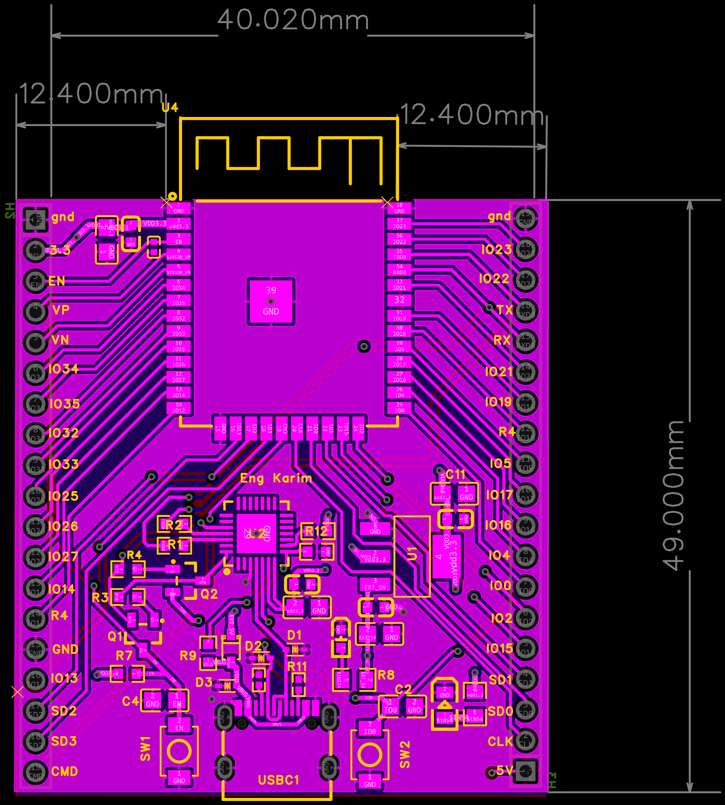

# ⚡ Kareem Taha

### Electrical & Electronics Engineer

**IC / VLSI Design · Embedded Systems · PCB Design · Power Systems · Building Automation**

📍 Ramallah, Palestine  • 
📧 [karimbtaha6@gmail.com](mailto:karimbtaha6@gmail.com)  • 
🔗 [LinkedIn](https://www.linkedin.com/in/kareem-taha-553362356/)

 

  

> From transistor-level circuits and digital hardware
> to embedded systems, PCBs, and electrical power distribution.

---

## ⚡ About Me

I am an Electrical Engineering graduate from Birzeit University with hands-on experience across both electronics and electrical power engineering.

My work spans transistor-level IC design, digital hardware, embedded systems, custom PCB development, low-voltage distribution systems, electrical panels, PLC fundamentals, and KNX building automation.

I enjoy understanding hardware from the lowest level — how a transistor behaves inside a circuit — up to complete systems that sense, process, communicate, and distribute electrical power.

* 🎓 B.Sc. Electrical Engineering — Birzeit University
* 🔬 Interested in IC/VLSI design, physical design, and design verification
* 🔧 Hands-on experience with embedded systems and custom PCB development
* ⚡ Practical experience in LV power distribution and electrical panels
* 🏢 Familiar with KNX/ETS6 building automation and PLC systems
* 🚀 Open to graduate and junior Electrical/Electronics Engineering opportunities

---

# 🔌 Engineering Portfolio

### From Silicon → PCB → Embedded Hardware → Power Systems

`IC Design` → `Digital Logic` → `Embedded Systems` → `PCB Design` → `Electrical Systems`

---

## 🚀 Featured Engineering Projects

### 🦯 PaldiBlind — Assistive Navigation System

<table>
<tr>
<td width="58%" valign="top">

My graduation project focused on developing an assistive navigation device for visually impaired users.

The system combines an **ESP32-S3**, GNSS outdoor positioning, UWB indoor positioning, embedded firmware, and custom PCB hardware into a complete prototype.

#### Engineering Work

* Designed the custom PCB and hardware architecture
* Integrated ESP32-S3, GNSS, UWB, and peripheral circuitry
* Developed embedded C/C++ firmware
* Implemented outdoor and indoor positioning
* Tested and calibrated the positioning system
* Designed the prototype enclosure

**Technologies**

`ESP32-S3` `GNSS` `UWB` `Embedded C/C++` `PCB Design`

 

[🔗 View Project](https://github.com/karimtaha007/cv_projects_/tree/main/gradution%20project)

</td>

<td width="42%" align="center">

 

</td>
</tr>
</table>

---

### 🔌 Custom ESP32 Development Board

<table>
<tr>
<td width="42%" align="center">

 

</td>

<td width="58%" valign="top">

Designed a custom **ESP32 development board from schematic to PCB layout**, integrating the major circuits required for programming, communication, and power management.

#### Engineering Work

* USB-C interface design
* USB-to-UART communication circuit
* Voltage regulation and power distribution
* ESP32 support circuitry
* Component and footprint selection from datasheets
* PCB component placement and routing
* Ground/power plane implementation
* DRC and layout verification

**Tools & Technologies**

`EasyEDA` `ESP32` `USB-C` `USB-to-UART` `PCB Layout` `DRC`

 

[🔗 View PCB Projects](https://github.com/karimtaha007/cv_projects_)

</td>
</tr>
</table>

---

### ⚡ Power Distribution & Electrical Panels — Melemco

<table>
<tr>
<td width="58%" valign="top">

Practical engineering training focused on low-voltage electrical distribution systems, panel assembly, protection, and building automation.

#### Engineering Work

* Electrical load calculations
* Cable sizing
* Circuit-breaker selection
* Three-phase power distribution
* Electrical panel assembly
* Power and control wiring
* Reading single-line diagrams
* Exposure to PLC-based control
* KNX device installation and ETS6 configuration

Worked on a **400 A three-phase distribution board** during the training period.

**Technologies**

`LV Distribution` `Three Phase` `Protection` `Panel Wiring` `KNX` `ETS6`

 

[🔗 View Project](https://github.com/karimtaha007/cv_projects_/tree/main/Melemco%20Co)

</td>

<td width="42%" align="center">

 

</td>
</tr>
</table>

---

### 🔐 SRAM PUF Array — IC / VLSI Design

Designed a **4 × 4 SRAM-based Physical Unclonable Function (PUF)** for hardware-security applications.

* Transistor-level SRAM cell design
* SRAM PUF array architecture
* Symmetrical transistor placement
* Floorplanning and physical layout
* VDD/GND routing
* DRC verification
* LVS verification
* Circuit simulation and power analysis

**Tools**

`CMOS` `Electric VLSI` `LTspice` `DRC` `LVS`

[🔗 View Project](https://github.com/karimtaha007/cv_projects_/tree/main/SRAM%20PUF%20ARRAY%20DESIGN)

---

### 🧮 Digital Multiplier — RCA vs. CLA

Designed and verified a Verilog multiplier architecture while comparing **Ripple Carry Adder (RCA)** and **Carry Look-Ahead Adder (CLA)** implementations.

* RTL design in Verilog HDL
* Functional simulation
* Testbench development
* Propagation-delay analysis
* Critical-path analysis
* RCA versus CLA timing comparison

**Tools**

`Verilog HDL` `Active-HDL` `Digital Design` `Timing Analysis`

[🔗 View Project](https://github.com/karimtaha007/cv_projects_/tree/main/MULTIPLIER%20DESIGN)

---

### 🔬 Analog / Mixed-Signal IC Design — uWave Semiconductor

Completed practical training covering transistor-level analog integrated-circuit design and simulation.

* Common-source amplifier design
* Common-drain amplifier design
* Differential amplifier design
* MOSFET biasing
* Operating-region analysis
* DC analysis
* Transient analysis
* AC and frequency-response analysis

**Tools**

`Synopsys Custom Compiler` `CMOS` `Analog IC Design` `SPICE Simulation`

[🔗 View Training Projects](https://github.com/karimtaha007/cv_projects_/tree/main/uWave)

---

# 🛠️ Engineering Toolbox

### 🔬 IC / VLSI

`CMOS Design` · `Transistor-Level Design` · `DRC/LVS` · `Analog Simulation`

### 🔧 Embedded Systems

`Microcontrollers` · `Sensors` · `UART` · `SPI` · `I²C` · `GNSS` · `UWB`

### 🔌 PCB Design

`Schematic Capture` · `Component Placement` · `Routing` · `Power/Ground Planes` · `DRC`

### 🧮 Digital Design

`RTL Design` · `Simulation` · `Testbenches` · `Timing Analysis`

### ⚡ Power & Electrical Systems

`LV Distribution` · `Load Calculations` · `Cable Sizing` · `Breaker Sizing` · `Panel Wiring`

### 🏢 Automation & Control

`Building Automation` · `KNX Topology` · `Sensors & Actuators` · `PLC Fundamentals`

---

## 📷 Hardware Gallery

&nbsp;

&nbsp;

&nbsp;

 

*Embedded Systems · PCB Design · IC Design · Electrical Power*

---

## 🎯 Engineering Interests

I am particularly interested in roles involving:

`IC / VLSI Design`
`Physical Design`
`Design Verification`
`Analog & Mixed-Signal IC Design`
`Embedded Systems`
`PCB & Hardware Design`
`Electrical Power Distribution`
`Industrial & Building Automation`

---

## 📂 Complete Portfolio

For schematics, PCB layouts, simulations, reports, and additional engineering projects:

### ➜ [View My Engineering Portfolio](https://github.com/karimtaha007/cv_projects_)

---

## ⚡ Let's Connect

I am open to graduate roles, junior engineering positions, internships, and technical collaborations in Electrical and Electronics Engineering.

 

