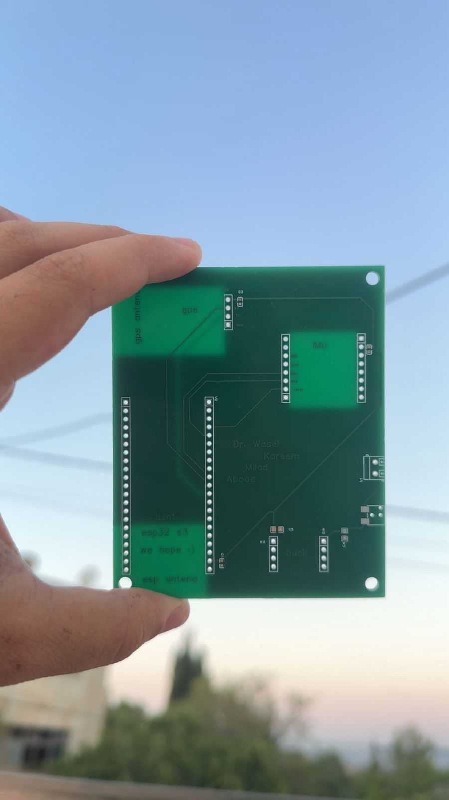
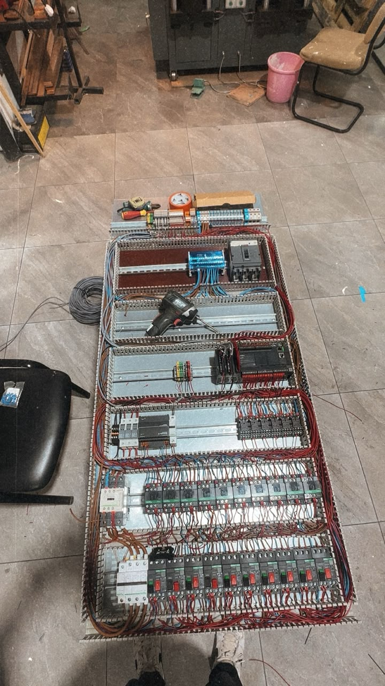
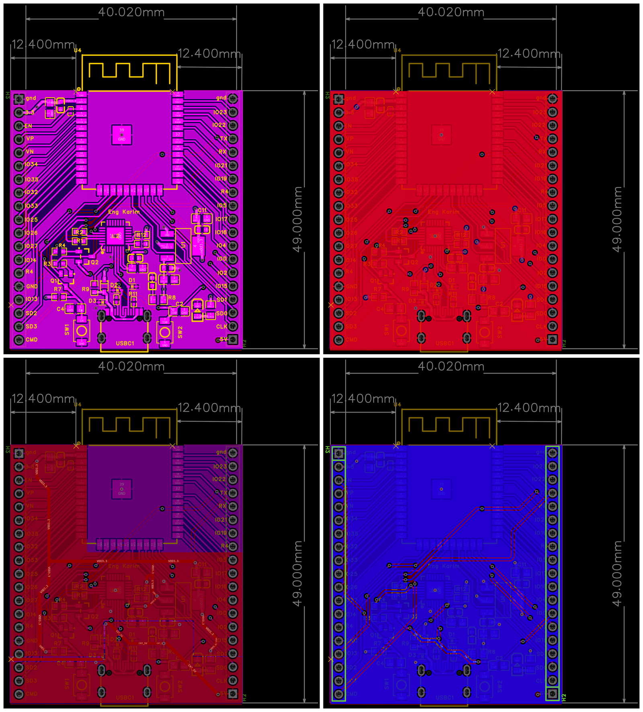

  

# 👋 Hi there! I'm Kareem Taha 👋

### Automation · Power Distribution · IC Design ⚡🇵🇸

📧 [karimbtaha6@gmail.com](mailto:karimbtaha6@gmail.com) · 📍 Ramallah, Palestine · [GitHub](https://github.com/karimtaha007)

  
  
  
  
  
  

Electrical Engineering graduate with hands-on experience across multiple levels of electrical hardware design — from transistor-level IC design and embedded systems to PCB development, low-voltage power distribution, and building automation.

---

## Projects

### PaldiBlind — Assistive Navigation Device

Graduation project focused on developing an assistive navigation device for visually impaired users using GNSS for outdoor positioning and UWB for indoor positioning.

  
  &nbsp;&nbsp;
  

* Designed a custom PCB integrating ESP32-S3, GNSS, UWB, and supporting hardware.
* Developed embedded firmware for positioning and sensor integration.
* Designed and assembled a 3D-printed enclosure for the prototype.

`ESP32-S3` `GNSS` `UWB` `Embedded C/C++` `PCB Design`

---

### Melemco — Power Distribution & KNX Panels

Practical electrical engineering training involving low-voltage power distribution, electrical panels, and building automation systems.

  
  &nbsp;&nbsp;
  

* Performed load calculations and cable/breaker sizing.
* Participated in assembly and wiring of a 400 A three-phase distribution board.
* Worked with power and control wiring based on single-line diagrams.
* Gained practical exposure to KNX systems and ETS6 configuration.

`Three-Phase Distribution` `Cable Sizing` `Protection` `KNX` `ETS6`

---

### SRAM PUF Array Design

Designed and verified a 4×4 SRAM-based Physical Unclonable Function, from system architecture down to transistor-level layout.

<table>
<tr>
<td width="50%" align="center"></td>
<td width="50%" align="center"></td>
</tr>
</table>

Array + comparator readout architecture (left) · SPICE simulation of a PUF output bit (right)

* Designed the array, decoder, and comparator-based readout architecture.
* Developed the physical layout with symmetric transistor placement and VDD/GND routing.
* Verified functionality through SPICE simulation and performed DRC/LVS checks.
* Evaluated final circuit area and power consumption.

`CMOS` `Electric VLSI` `LTspice` `DRC` `LVS`

---

### Custom ESP32-WROOM-32 Development Board

Custom ESP32 development board designed from schematic capture through PCB layout and verification in EasyEDA.

  
  &nbsp;&nbsp;
  

3D render (left) · silkscreen, plane, and routing layers (right)

* Designed USB-C, USB-to-UART, and voltage-regulation circuitry.
* Selected components and footprints using datasheets and reference designs.
* Completed component placement, routing, copper planes, and DRC verification.

`EasyEDA` `ESP32-WROOM-32` `USB-C` `USB-to-UART` `PCB Layout`

---

### uWave Semiconductor — Analog/Mixed-Signal IC Training

Completed practical training in transistor-level analog and mixed-signal IC design.

* Designed common-source and common-drain amplifier circuits.
* Designed and analyzed differential amplifier stages.
* Performed DC, transient, AC, and frequency-response simulations.
* Evaluated transistor biasing, gain, and operating regions.

`Synopsys Custom Compiler` `CMOS` `Analog IC Design` `Circuit Simulation`

---

### Multiplier Design — RCA vs. CLA

Designed a Verilog-based multiplier and compared Ripple Carry Adder and Carry Look-Ahead Adder architectures.

* Developed and simulated the digital architecture.
* Created testbenches for functional verification.
* Analyzed propagation delay and critical paths.
* Compared RCA and CLA timing performance.

`Verilog HDL` `Active-HDL` `Digital Design` `Timing Analysis`

---

### Microcomputer Architecture Design

Designed and simulated a digital microcomputer architecture integrating processing, memory, and control units.

* Developed digital logic blocks for processing and control.
* Integrated memory and data-flow components.
* Performed system-level simulation and functional validation.

`Computer Architecture` `Digital Logic` `Simulation`

---

## Technical Skills

| Area                 | Tools & Technologies                                           |
| -------------------- | -------------------------------------------------------------- |
| IC / VLSI            | Synopsys Custom Compiler, Electric VLSI, LTspice, OrCAD PSpice |
| Embedded Systems     | ESP32, C/C++, Arduino IDE, Python                              |
| PCB Design           | EasyEDA, KiCad, schematic capture, layout, DRC                 |
| Digital Design       | Verilog HDL, Active-HDL, Quartus Prime                         |
| Power Systems        | ETAP, PowerWorld, LV distribution, cable & breaker sizing      |
| Building Automation  | KNX, ETS6                                                      |
| Engineering Software | MATLAB/Simulink, AutoCAD, Proteus                              |

---

## Current Interests

I am currently interested in graduate and junior engineering opportunities involving:

* IC / VLSI Design
* Analog and Mixed-Signal IC Design
* Embedded Systems
* PCB Design and Hardware Development
* Electrical Power Distribution
* KNX and Building Automation

---

### Contact

📧 [karimbtaha6@gmail.com](mailto:karimbtaha6@gmail.com)
📍 Ramallah, Palestine
💻 [github.com/karimtaha007](https://github.com/karimtaha007)
